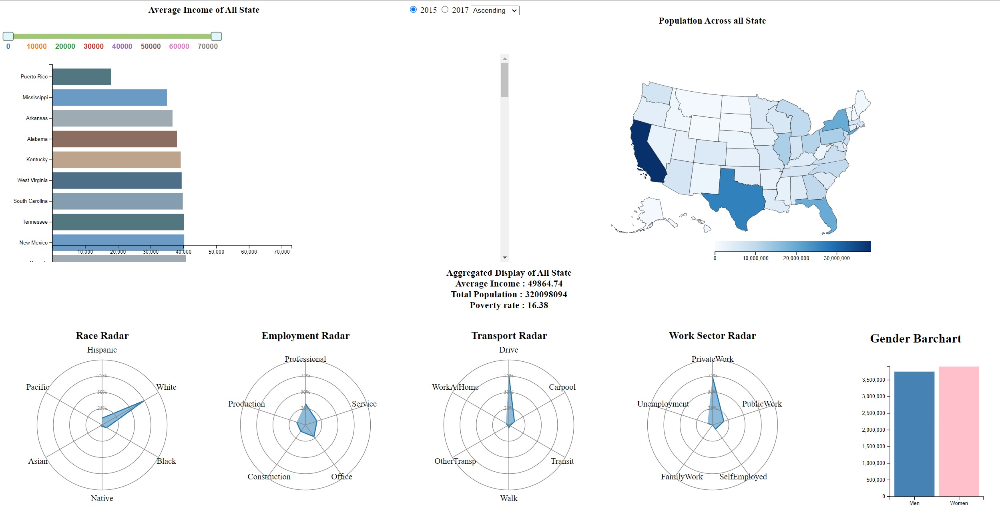

# cv-builder

This d3.js project is created using d3js for Multimedia University data visualization project



## **Features**

- Interactive data visualization to select any state and view its respective data.
- Interchangeable year option to view different US Census data.

## **Getting Started**

```
HTTPS - git clone https://github.com/ChaoticHG/D3JS-USCensus-2015-17.git

SSH - git clone git@github.com:ChaoticHG/D3JS-USCensus-2015-17.git

cd D3JS-USCensus-2015-17

Use visual studio with live server plugin to run the project.html
```

## **Build with **

- D3.js
